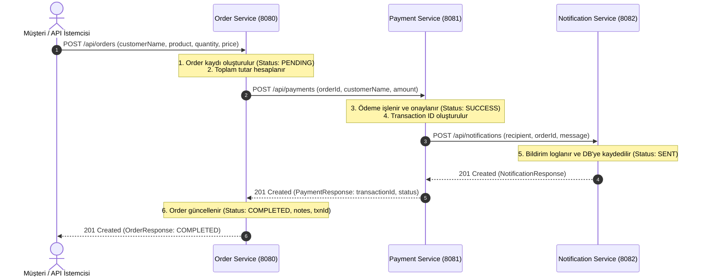

# 🚀 3-Microservice Spring Boot Projesi

Bu proje; **Java 17+**, **Spring Boot 3.x** ve **Maven multi-module** mimarisi ile geliştirilmiş, konteynerleştirilmiş ve Kubernetes için Helm Chart'ları hazırlanmış 3 mikroservisten oluşmaktadır.

---

## 🏗️ Proje Mimarisi ve Modül Yapısı

```
spring-boot-microservices/
├── pom.xml                               # Parent POM (Multi-module aggregator)
├── docker-compose.yml                    # Yerel çoklu konteyner orkestrasyonu
├── mvnw / mvnw.cmd                       # Maven Wrapper araçları
├── .gitignore
├── README.md
│
├── order-service/                        # Port: 8080
│   ├── pom.xml
│   ├── Dockerfile                        # Multi-stage (openjdk:17-slim)
│   └── src/main/
│       ├── java/com/example/orderservice/
│       │   ├── OrderServiceApplication.java
│       │   ├── config/RestTemplateConfig.java
│       │   ├── controller/OrderController.java
│       │   ├── service/OrderService.java
│       │   ├── repository/OrderRepository.java
│       │   ├── entity/Order.java & OrderStatus.java
│       │   └── dto/CreateOrderRequest, OrderResponse, PaymentRequest, PaymentResponse
│       └── resources/application.yml
│
├── payment-service/                      # Port: 8081
│   ├── pom.xml
│   ├── Dockerfile                        # Multi-stage (openjdk:17-slim)
│   └── src/main/
│       ├── java/com/example/paymentservice/
│       │   ├── PaymentServiceApplication.java
│       │   ├── config/RestTemplateConfig.java
│       │   ├── controller/PaymentController.java
│       │   ├── service/PaymentService.java
│       │   ├── repository/PaymentRepository.java
│       │   ├── entity/Payment.java & PaymentStatus.java
│       │   └── dto/PaymentRequest, PaymentResponse, NotificationRequest, NotificationResponse
│       └── resources/application.yml
│
├── notification-service/                 # Port: 8082
│   ├── pom.xml
│   ├── Dockerfile                        # Multi-stage (openjdk:17-slim)
│   └── src/main/
│       ├── java/com/example/notificationservice/
│       │   ├── NotificationServiceApplication.java
│       │   ├── controller/NotificationController.java
│       │   ├── service/NotificationService.java
│       │   ├── repository/NotificationRepository.java
│       │   ├── entity/Notification.java & NotificationStatus.java
│       │   └── dto/NotificationRequest, NotificationResponse
│       └── resources/application.yml
│
├── helm/                                 # Kubernetes Helm Charts
│   ├── order-service/                    # Chart.yaml, values.yaml (replica: 3), templates/
│   ├── payment-service/                  # Chart.yaml, values.yaml (replica: 3), templates/
│   └── notification-service/             # Chart.yaml, values.yaml (replica: 3), templates/
│
└── scripts/                              # Yük Testi Simülasyonu
    ├── load-test.sh                      # Bash / cURL yük testi (30 sn'de 100+ istek)
    └── load-test.ps1                     # PowerShell yük testi (Windows)
```

---

## 🔄 Mikroservis Akışı (Sequence Diagram)



---

## ⚙️ Gereksinimler & Teknolojiler

- **Java**: OpenJDK 17+ (Java 21 ile de tam uyumlu)
- **Spring Boot**: 3.3.4
- **Modüller**:
  - Spring Web (REST API)
  - Spring Data JPA (H2 In-Memory DB)
  - Spring Boot Actuator (Health check probes: `/actuator/health`)
  - Jakarta Validation
  - Spring RestTemplate (HTTP İletişimi)
- **Docker**: Multi-stage build (`maven:3.9.6-eclipse-temurin-17` -> `openjdk:17-slim`)
- **Kubernetes / Helm**: Replica: 3, Readiness & Liveness Probes, ClusterIP Service, ConfigMap

---

## 🚀 Çalıştırma Yöntemleri

### 1. Yerel Olarak Çalıştırma (Maven)

Projeyi kök dizinden derleyin:
```bash
# Windows
.\mvnw.cmd clean package -DskipTests

# Linux / macOS
./mvnw clean package -DskipTests
```

Servisleri ayrı terminallerde sırasıyla başlatın:
```bash
# 1. Terminal: Notification Service (Port 8082)
cd notification-service
java -jar target/notification-service-1.0.0-SNAPSHOT.jar

# 2. Terminal: Payment Service (Port 8081)
cd payment-service
java -jar target/payment-service-1.0.0-SNAPSHOT.jar

# 3. Terminal: Order Service (Port 8080)
cd order-service
java -jar target/order-service-1.0.0-SNAPSHOT.jar
```

---

### 2. Docker Compose ile Çalıştırma (Önerilen)

Tüm servisleri tek bir komutla ayağa kaldırın:
```bash
docker compose up --build -d
```

Konteyner durumlarını ve health check sonuçlarını kontrol edin:
```bash
docker compose ps
```

Logları izlemek için:
```bash
docker compose logs -f
```

---

### 3. Kubernetes / Helm ile Dağıtım (Deploy)

Her servis için ayrı hazırlanmış Helm Chart'ları kullanarak Kubernetes kümenize dağıtın:

```bash
# 1. Docker imajlarını oluşturun
docker build -t order-service:latest ./order-service
docker build -t payment-service:latest ./payment-service
docker build -t notification-service:latest ./notification-service

# 2. Helm ile servisleri kurun
helm install notification-service ./helm/notification-service
helm install payment-service ./helm/payment-service
helm install order-service ./helm/order-service

# 3. Pod ve servis durumlarını görüntüleyin
kubectl get pods -o wide
kubectl get svc
```

> **Not:** Her Chart'ın `values.yaml` dosyasında `replicaCount: 3` olarak yapılandırılmıştır. `/actuator/health` endpoint'i üzerinden hem `readinessProbe` hem de `livenessProbe` aktif çalışmaktadır.

---

## 📡 API Endpoint'leri ve Test Örnekleri

### 1. Sipariş Oluşturma (Order Service)
```bash
curl -X POST http://localhost:8080/api/orders \
  -H "Content-Type: application/json" \
  -d '{
    "customerName": "Ahmet Yilmaz",
    "product": "MacBook Pro M3",
    "quantity": 1,
    "price": 1999.99
  }'
```

**Örnek Başarılı Yanıt (HTTP 201):**
```json
{
  "id": 1,
  "customerName": "Ahmet Yilmaz",
  "product": "MacBook Pro M3",
  "quantity": 1,
  "price": 1999.99,
  "status": "COMPLETED",
  "paymentTransactionId": "TXN-9F4D2B8A1C0E",
  "notes": "Payment completed successfully",
  "createdAt": "2026-09-30T20:45:00.123456"
}
```

### 2. Tüm Siparişleri Listeleme
```bash
curl http://localhost:8080/api/orders
```

### 3. Ödemeleri Görüntüleme (Payment Service)
```bash
curl http://localhost:8081/api/payments
```

### 4. Bildirimleri Görüntüleme (Notification Service)
```bash
curl http://localhost:8082/api/notifications
```

### 5. Health Check Endpoint'leri (Spring Actuator)
```bash
curl http://localhost:8080/actuator/health
curl http://localhost:8081/actuator/health
curl http://localhost:8082/actuator/health
```

---

## ⚡ Yük Testi (Load Testing)

Gereksinim: **30 saniyede 100+ istek simülasyonu**

### Yöntem A: PowerShell Script ile (Windows)
```powershell
.\scripts\load-test.ps1 -TargetUrl "http://localhost:8080/api/orders" -DurationSec 30 -TargetRequests 120
```

### Yöntem B: Bash Script ile (Linux / macOS / Git Bash)
```bash
chmod +x ./scripts/load-test.sh
./scripts/load-test.sh http://localhost:8080/api/orders
```

### Yöntem C: ApacheBench ile
```bash
# payload.json oluşturun:
echo '{"customerName":"LoadTester","product":"Server RAM","quantity":2,"price":150.00}' > payload.json

# 120 istek, 4 eşzamanlı bağlantı:
ab -n 120 -c 4 -p payload.json -T application/json http://localhost:8080/api/orders
```

---

## 📦 Git Başlatma (Git Repository Setup)

Projeyi yeni bir git deposu olarak başlatmak için:
```bash
git init
git add .
git commit -m "feat: initial commit for 3-microservice Spring Boot project"
```
